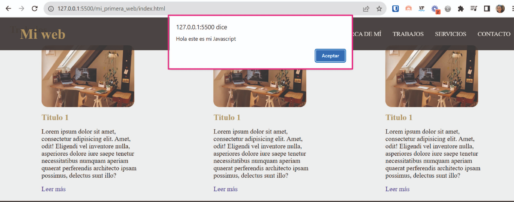

# clase_08
# 🏠 Paso 22 - ¡Comenzamos con Javascript!


## 👋 ¡Bienvenido a tu siguiente paso! 
¡Hola! Seguimos avanzando 👟

En los pasos previos estuvimos viendo cómo crear un sitio web en HTML, cómo darle estilo con CSS y cómo hacer que se adapte a distintos navegadores. 

Ahora vamos a ver cómo hacerlo más interactivo con el uso de Javascript. 

¿Listo? ¡Vamos! 🚀

# 📖 Material descargable
Aquí es donde encontrarás el material descargable que complementará los ejercicios prácticos que vamos a ver en los siguientes pasos. 

Para tu primer encuentro en vivo tienes que leer solo el material que te compartimos a continuación 👉Javascript


📢 ¡Importante!

No debes memorizar, concéntrate en entender el concepto. La práctica hará que luego puedas aplicarlo con más agilidad.

Si hay algo que no comprendes, ¡no te preocupes! Anótalo y pregunta a tus compañeros en el encuentro en vivo.

✍️ Para tu próximo encuentro en vivo
En esta ocasión te vamos a pedir que puedas ver el siguiente video sobre cómo ejecutar código Javascript en la consola del navegador.
https://youtu.be/XeBlwsNEFho

Es muy importante entender cómo visualizar el código en la consola ya que ¡lo vamos a usar más adelante!

✅ Checklist
Asegúrate de:

Leer el material para la clase

Ver el video sobre cómo ejecutar código en la consola

💡 Revisar estos puntos es muy importante dado que ayudarán a que todos puedan tener la mejor experiencia posible y logren resolver los desafíos correspondientes. 

# 👣 Paso 23 - ¡A trabajar en equipo!


## 👋 ¡Bienvenido a tu siguiente paso! 
Llegó el momento de ver cómo trabajar con Javascript.

¡Continuemos! 🚀

💡 Para este paso, les vamos a pedir que:

🔸Resuelvan individualmente el ejercicio en su propia computadora.

🔸Preguntar a tus compañeros en caso de no entender alguna parte. 

🔸Si no logran resolver algo entre todos, no olviden llamar al mentor para que los ayude. 

📌 ¡Recuerden mantener las cámaras encendidas en todo el proceso! ¡Sé protagonista de tus objetivos!

✏️ Actividad - Creando el primer archivo javascript
Así como para trabajar con CSS precisamos crear un archivo styles.css y vincularlo a nuestro sitio, lo mismo ocurre con los archivos Javascript. En este caso la extensión será .js. 

Entonces vamos a crear nuestro archivo siguiendo estos pasos:

1. Dentro de la carpeta de mi_primera_web, crea un archivo llamado script.js y coloca el siguiente código:
```
alert("Hola este es mi Javascript");
```
2. Dentro de tu archivo index.html entre las etiquetas <head></head>, coloca el siguiente código que linkea el archivo script.js al index.html
```
<script src="script.js"></script>
```
📌 Una vez que realices estos pasos verás una alerta como la siguiente en tu web


💡El alerta en Javascript es lo que llamamos una función. Porque es posible utilizarla varias veces y recibe un parámetro. Que en este caso es el texto que le pusimos dentro. 

3. Comenta el código anterior para que el navegador no lo lea. Esto se hace con doble barra, deberías escribir lo siguiente
```
//alert("Hola este es mi Javascript");
```
📌Los comentarios son útiles cuando queremos que el navegador no interprete ese código.

🎥 Si tienen dudas, pueden ver el siguiente video donde realizamos este paso.
https://youtu.be/kYDsbDMia60

🖥️ Cuando todos hayan logrado seguir las instrucciones, de a uno vayan compartiendo pantalla mostrando su código y el resultado de su código.

## ✏️ Actividad - Variables en Javascript
¡Excelente! En la actividad anterior creamos el primer archivo Javascript. 

Ahora continuemos revisando otros conceptos, como variables y constantes.

Una variable/constante no es más que una cajita que guarda un valor a ser utilizado más adelante. Lo podemos declarar de 3 formas:

* let nombre = “mi nombre”;

* const nombre = “mi nombre”;

* var nombre = “mi nombre”;

Las más utilizadas son let y const.  Su diferencia es que let puede variar su contenido y le podemos asignar otro, en cambio a const no, por ser una constante. Es decir que recibe un valor que quedará fijo desde que se asigne. 

Entonces, podríamos definir una variable de la siguiente manera:
```
let nombre = “Marta”;
```
📌 Mira el siguiente video dónde mostramos cómo declarar variables y verlas en consola
https://youtu.be/DlxBMQ118EE

➕ Vamos a continuar trabajando en el archivo script.js

1.  Crea una variable en Javascript que se llame nombre y que reciba como valor tu nombre. 

2. Imprime este valor en la consola del navegador.

🖥️ Cuando todos hayan logrado seguir las instrucciones, de a uno vayan compartiendo pantalla mostrando su código y el resultado de su código.

## ✅ Checklist
Asegúrate de:

* Entender cómo linkear un archivo Javascript en tu sitio

* Ver cómo se definen las variables

* Revisar cómo se puede acceder a un elemento HTML desde el DOM y cambiar su contenido. 

💡 Revisar estos puntos es muy importante dado que ayudarán a que todos puedan tener la mejor experiencia posible y logren resolver los desafíos correspondientes.

🔎 Resumen y buenas prácticas aprendidas
Javascript es un lenguaje muy amplio, aquí veremos partes para aplicar a la web

El DOM es una representación de la estructura de un documento HTML en el navegador

Javascript permite agregar dinamismo a las páginas web.

# 👣 Paso 24 - ¡Continuamos con Javascript!

## 👋 ¡Bienvenido a tu siguiente paso! 
En el paso anterior comenzamos a poner en práctica los primeros códigos con Javascript. Ahora vamos a ver otros conceptos.

¡Continuemos! 🚀

💡 Para este paso, les vamos a pedir que:

🔸Resuelvan individualmente el ejercicio en su propia computadora.

🔸Preguntar a tus compañeros en caso de no entender alguna parte. 

🔸Si no logran resolver algo entre todos, no olviden llamar al mentor para que los ayude. 

📌 ¡Recuerden mantener las cámaras encendidas en todo el proceso! ¡Sé protagonista de tus objetivos!

## ✏️ Actividad - Condicionales en Javascript
📌 Mira el siguiente video dónde mostramos cómo hacer condicionales en Javascript

https://youtu.be/c7_Q5qOASdc

➕ Vamos a continuar trabajando en el archivo script.js

Crea un condicional que modifique el texto del elemento “Acerca de mí” dependiendo de si la condición se cumple o no se cumple.

🖥️ Cuando todos hayan logrado seguir las instrucciones, de a uno vayan compartiendo pantalla mostrando su código y el resultado de su código.

## ✏️ Actividad - Funciones en Javascript

📌 Mira el siguiente video dónde mostramos cómo hacer funciones en Javascript

https://youtu.be/z9ydd8ekpzY

➕ Vamos a continuar trabajando en el archivo script.js

Crea una función que modifique el texto del elemento “Acerca de mí” definiendo previamente en la función el texto que quiero utilizar. 

🖥️ Cuando todos hayan logrado seguir las instrucciones, de a uno vayan compartiendo pantalla mostrando su código y el resultado de su código. 

## ✏️ Actividad - Menú mobile en Javascript

Descarga la siguiente carpeta dentro de tu compu, y colócala dentro de la carpeta de PWDC 👉Link Carpetas

Abre el archivo nav.html con el liver server y revisa cómo se ve el menú achicando la pantalla del navegador

📌 Verás que al hacer click aún no sucede nada. Y esto es porque vamos a aplicar un código Javascript para que funcione el menú. 

Crear un archivo script.js y linkealo al archivo nav.html

Copia el siguiente código Javascript en el archivo script.js

```
     let menu_responsive = document.querySelector(".checkbtn");
      menu_responsive.onclick = function () {
        navBar = document.querySelector(".navbar");
        navBar.classList.toggle("active");
      };
```

Ahora, al hacer click deberías ver cómo se despliega el menú. Pero ¿Qué hace este código?

Lo veremos en el siguiente video:
https://youtu.be/LmaS1skvOHk

5. Ahora apliquen el script al menú de su web. Van a tener que modificar el CSS anterior para que se adapte al script.

## ✨ Video complementario
Les compartimos este video complementario sobre 👉 Cómo manipular el DOM con JavaScript (https://youtu.be/X98UzugImW4?feature=shared). En el mismo van a ver más formas de cómo manipular el DOM. Dura 47 minutos, por lo que les proponemos que lo vean con calma en sus casas para analizarlo y practicar.
## 📓 Test
Por último, te proponemos realizar un muy breve test para poner a prueba los aprendizajes alcanzados. Vamos 🚀

✅ Checklist
Asegúrate de:

* Revisar cómo se escriben condiciones en Javascript

* Revisar cómo se utilizan funciones en Javascript

💡 Revisar estos puntos es muy importante dado que ayudarán a que todos puedan tener la mejor experiencia posible y logren resolver los desafíos correspondientes. 

# 🔎 Resumen y buenas prácticas aprendidas
*Javascript es un lenguaje muy amplio, aquí veremos partes para aplicar a la web

* El DOM es una representación de la estructura de un documento HTML en el navegador

* Javascript permite agregar dinamismo a las páginas web

## 📓 Test
Por último, te proponemos realizar un muy breve test para poner a prueba los aprendizajes alcanzados. Vamos 🚀
📝 Realizar test
https://eggeducacion.typeform.com/to/KjOv1jOI#form_type=autoevaluacion&profile_id=65124ef5f615c80f596b9c98&step_id=3kMHMmttAZlPpajgte0khi&module_id=1aVJePrGRBrkp5WrfPIzbW&section_id=PpzNNBsxH0TZG9S1IENad

⏭️ En el próximo encuentro veremos cómo hacer formularios y validarlos utilizando Javascript